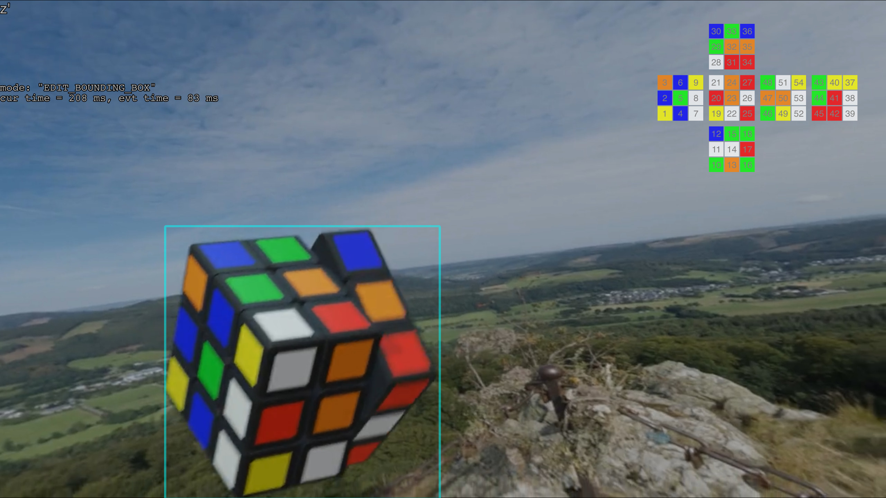

# Requirements

*   Blender 3.1.0 alpha ([2021-12-15 or
    later](https://developer.blender.org/D13446))

*   imagemagick or graphicsmagick (to provide the `identify` CLI tool, used to find bounding box from a matte)

# Usage

``` sh
blender --background ./cubev2.blend --python ./batch_render.py -- 1
```

The last argument determines how many clips to render. Each clip is 3-10 frames
long, and each frame takes ~1 second to render and process.

Clips are produced under the `renders` subdirectory. Each clip is accompanied
with cube-labels and bounding-boxes, compatible with the
[cube-reconstructions](https://github.com/chengsun/cube-reconstructions) tool.

# Samples

The below screenshots also include the cube-reconstructions overlay.




# License and credits

*   `batch_render.py`  
    `cubev2.blend`  

    I (Cheng Sun) release these files to the public domain, under CC0 1.0
    Universal.

*   `skyboxes`  

     Assets from ambientCG.com, licensed under CC0 1.0 Universal.
